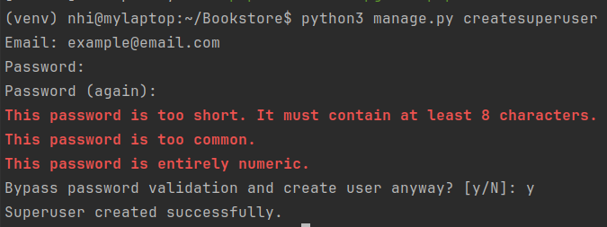
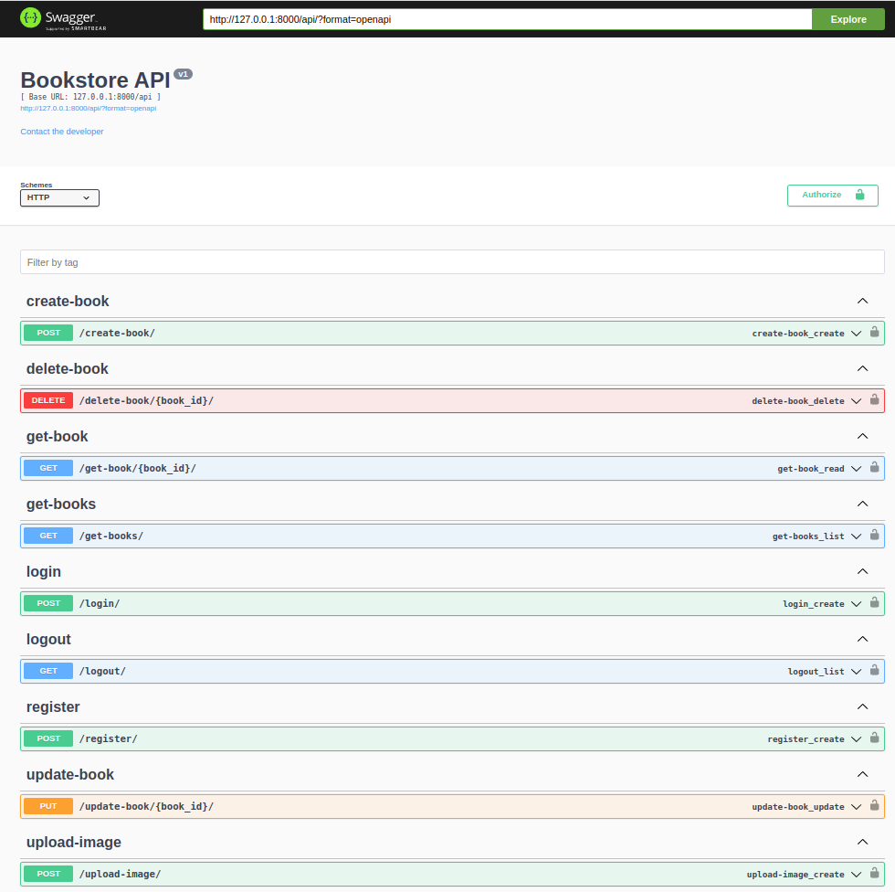
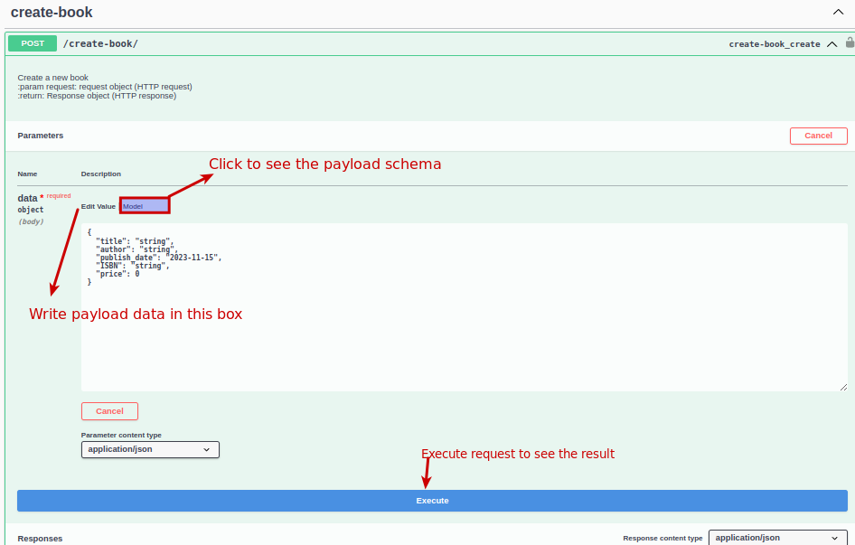
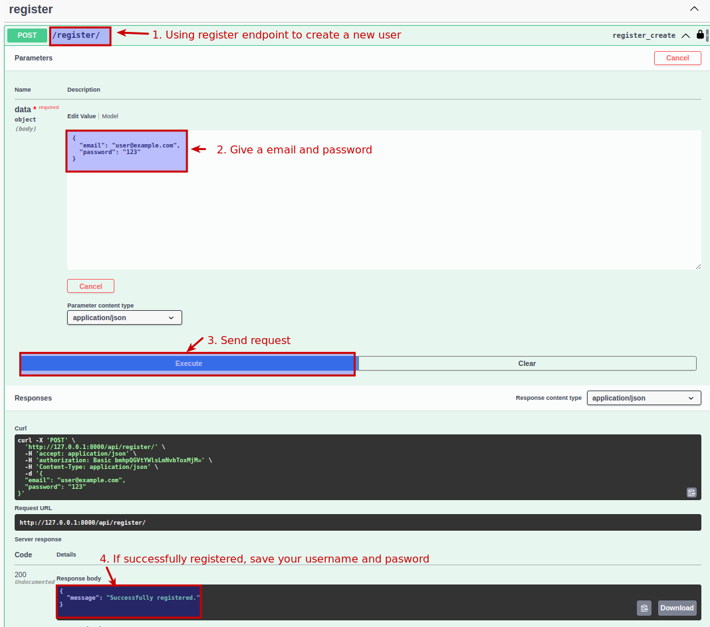
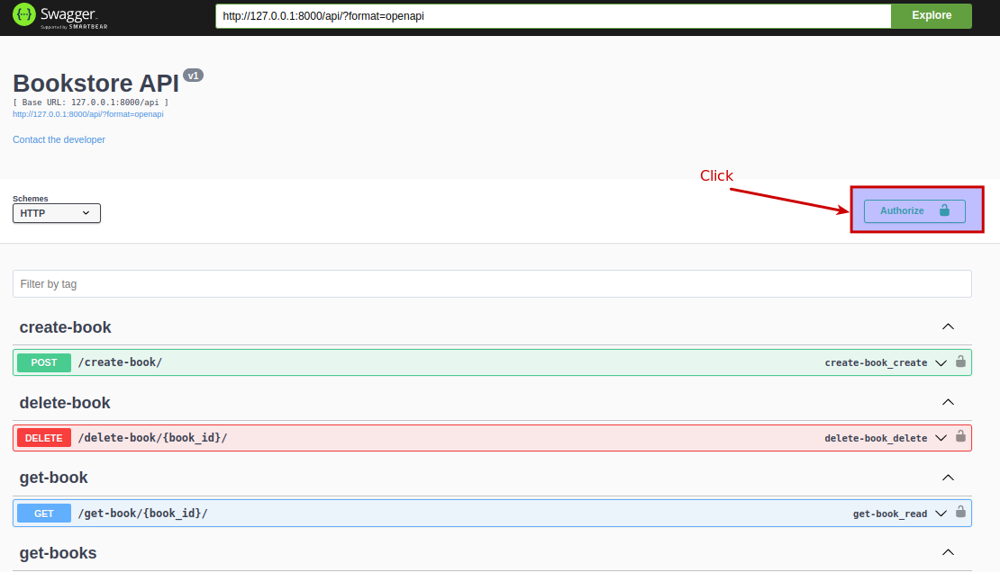
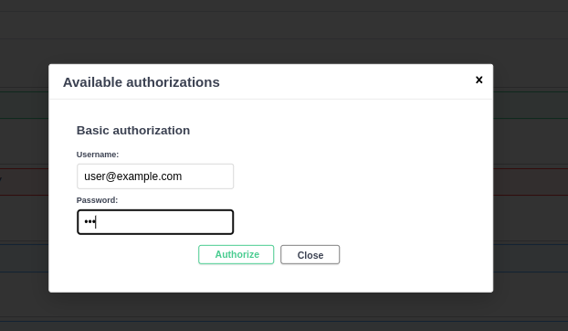

# Bookstore project
A restful API for a Bookstore   
- apps: 
  - api
- Diagrams (links below):
  - [Database diagram](media/guidelines/bookstore_db.drawio.png)
  - [Project Architecture](media/guidelines/architecture.png)
  - [Production system diagram](media/guidelines/system.png)

# Table of Contents
- [How to run the project on localhost](#1)
- [Test the api endpoint with OpenAI Swagger user interface](#2)
- [Authorize user](#3)
- [Access admin UI](#4)
- [Run unittest](#5)

## How to run the project on localhost <a name="1"/>
Requirements: 
- python3.8
- git

### Step 1: Clone the project
```git clone https://github.com/yen-nhi/Bookstore.git```

### Step 2: Create a virtual environment
- Install 2 necessary libraries
```
sudo apt install python3-pip
pip install virtualenv
sudo apt install python3.8-venv
``` 
- Get into inside the project directory 
```
cd Bookstore
```
- Create a virtual environment  
```
python3.8 venv -m venv
```

- Activate the virtual environment  
```
source venv/bin/activate
```

### Step 3: Install requirements packages 

```
pip install -r requirements.txt
```

### Step 4: Config the environments virables 
- In the project directory , create a new file with name ".env"
- Copy the content from ".env.example" to ".env" 
- Change/add your config (optional)

### Step 5: Migrate database
- If you have already a sqlite db or want to store the db in somewhere else, provide the path to the db 
by set an environment virable "DB_PATH" in ".env" file before running the below command.
- Otherwise, if this is the first time running the project without any available database, this below command 
by default will create a sqlite3 database in the project directory
```
python3 manage.py migrate
```
### Step 6: Create superuser for admin operations (optional)
To access the admin page for data checking, you need an admin user
```
python3 manage.py createsuperuser
```
It will ask for email and password and confirm the password, save the user.


### Step 7: Feww..., this is the final step.
Everything is ready, now run the command
```
python3 manage.py runserver
```

## Test the api endpoint with OpenAI Swagger user interface <a name="2"/>
### Create a HTTP request to trigger the api
- Open the browser and redirect to http://localhost:8000/api 



- Click to the endpoint you want to test -> click "**Try it out**" button -> instruction as below image



## Authorize user <a name="3"/>
Some apis need authorization (login). To be authorized, you need to create a user account.
The application has 2 way authorization
- For client server, they have to send an Authorization token in the header, the token can be obtained
from the response when the user login. For example request by cURL command
```
curl -X 'POST' \
  'http://127.0.0.1:8000/api/create-book/' \
  -H 'accept: application/json' \
  -H 'authorization: Token <your_user_token>' \   # Add your authorized token here
  -H 'Content-Type: application/json' \
  -d '{
  "title": "string",
  "author": "string",
  "publish_date": "2023-11-15",
  "ISBN": "string",
  "price": 10
}'
```
- For the swagger UI (the UI we are looking at) use Basic Auth with username and password
    + Create a user
    

  + Authorize user
  
  
    
+ After authorize the user, you can test the create, update or delete endpoints.

## Access admin UI <a name="4"/>
- Access http://localhost:8000/admin
- Login with superuser which has created above (see step 6, line 52)

## Run unittest <a name="5"/>
This command will collect all unittest and run them
```
python3 manage.py test
```
